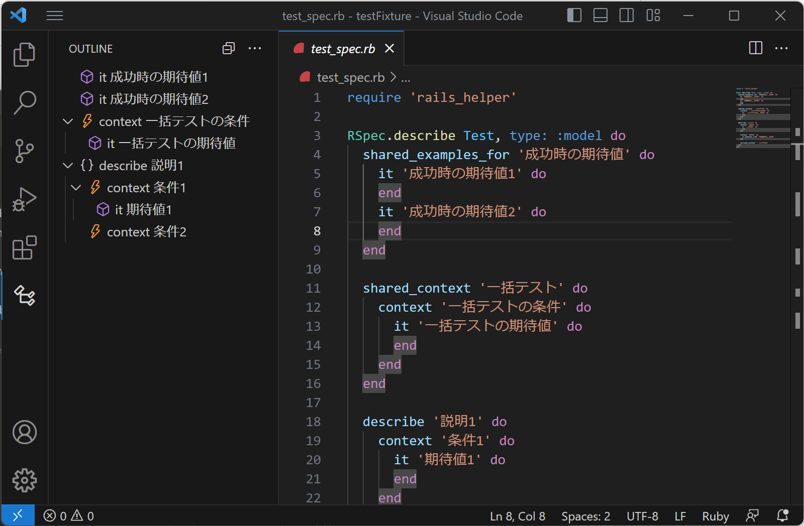

# vscode-rspec-outline

rspecのアウトラインを表示する拡張機能です。
**_spec.rbファイルのみ機能します。

## 本拡張機能の目的

長いテストファイルにて、どんなテストを書いているか把握するために使用されることを想定しています。そのため、シングルクォートで囲われている、一部のシンプルなブロックのみアウトラインに表示しています。

## インストール方法

1. Releasesから最新のvsixファイルをダウンロード
2. VSCode でCtrl+Shift+Pキーを押す  
コマンドパレットが開く
3. 「vsix」と入力してEnterキーを押す  
インストールするvsixファイルを選択する画面が開く
4. ダウンロードしたvsixファイルを選択して、Installをクリック

## 使い方

1. VSCodeの［View - Open View］から［Outline］を選択。  
Outline View が表示される。
2. VSCodeのExplorerで「*spec.rb」ファイルを開く。  
Outline View に現在編集中ファイルのアウトラインが表示される。

## 設定項目

### Display Block Name On Label

アウトラインの見出しにブロック名を表示するかを設定します。オフの場合は補足部分にブロック名を表示します。  
初期値はオフです。

## 表示対応ブロック

以下のブロックのみ、アウトラインに表示します。

|ブロック|表示形式|
|---|---|
|describe|Namespace|
|context|Event|
|include_context|Event|
|include_examples|Event|
|it|Method|
|it_behaves_like|Method|
|shared_examples|Module|
|shared_examples_for|Module|
|shared_context|Module|
